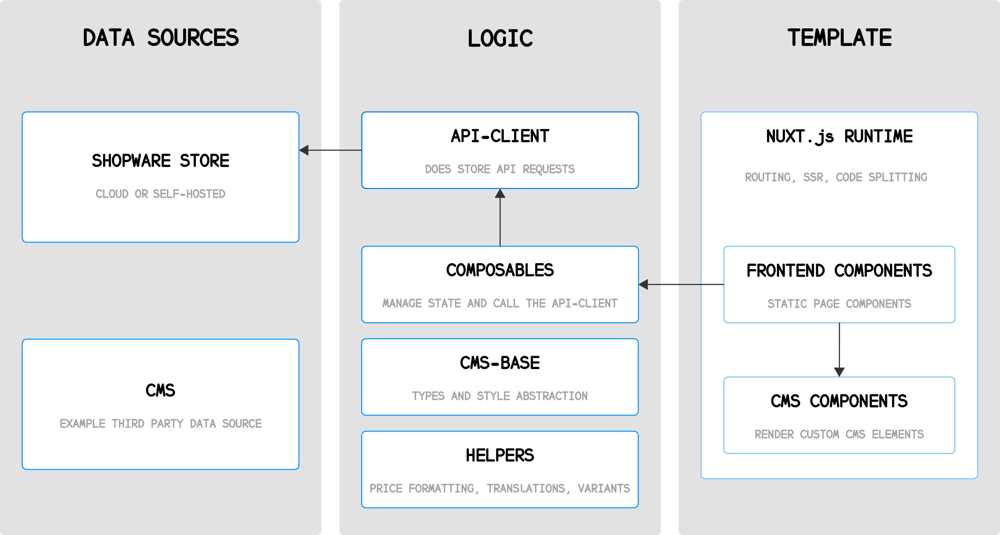

# Overview

Shopwell Composable Frontends is Shopwell's toolkit for creating platform-agnostic custom storefronts. The demo store implementation is based on Vue.js and Nuxt3.

## Quick Links

- **Announcements**: To keep yourself up to date with the latest news regarding the project, please regularly check our Github Discussions page: [shopwell/frontends/dicsussions](https://github.com/shopwell-shop/frontends/discussions). Especially the [Announcements](https://github.com/shopwell-shop/frontends/discussions/categories/announcements) category.

## How Shopwell Frontends work?

Frontends is a collection of multiple packages that you can use to implement your custom storefront project.

## Data Sources

Shopwell 6 is considered one "supported" data source, but you can integrate any other data source you like - such as CMS or analytics. Shopwell Frontends uses the Store API to connect with your Shopwell 6 instance at runtime.

## Logic

A big part (and a risk factor) of every custom storefront project is the implementation of domain-specific business functionality. That's why Shopwell Frontends offers various packages that take care of some heavy lifting:

- Routing
- Shopping worlds (Shopwell CMS) integration
- Product searches and filters
- Price formatting
- Authentication & state handling

It also comes with TypeScript support.

## Template/UI

You can decide to start from scratch and use no template at all, but we recommend looking at our [Templates](./introduction/templates.html) which are based on **Nuxt.js** and **Tailwind CSS**.

<PageRef title="Internal Structure" sub="Details about the internal structure of Shopwell Frontends" page="./concepts/internal-structure.html" />
