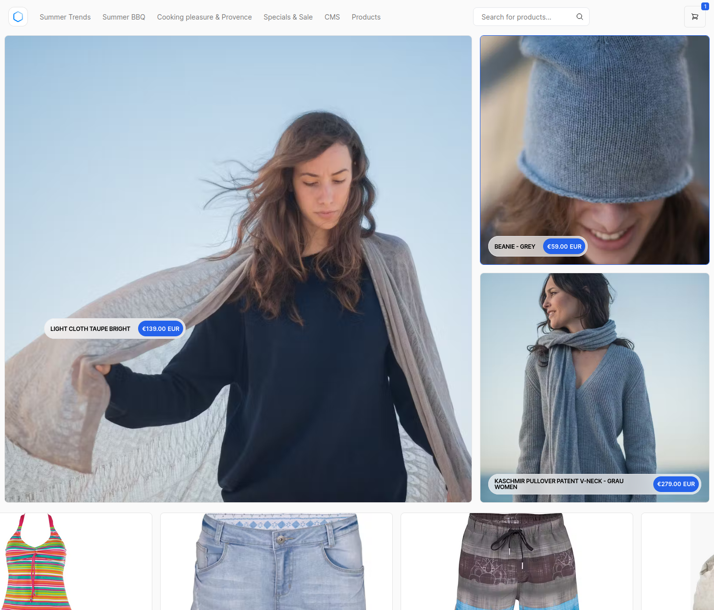

# Custom React project

:::info
This template is a prototype. It shows how to integrate Composable Forntends into React.
::::

## About this project

- **React** and **Next.js** with **App Router**
- It is based on the [vercel-commerce](https://github.com/shopwell-shopLabs/vercel-commerce) template
- It uses the new [api-client](https://www.npmjs.com/package/@shopwell/api-client)
- There is **no headless checkout**, we are currently working on supporting the default checkout
- Each page is currently **pre-generated** during build time
  - Vercel supports building partial pages after updating when sending a webhook
  - This feature was not tested with Shopwell (see API endpoint [here](https://github.com/shopwell-shopLabs/vercel-commerce/blob/main/lib/shopwell/index.ts#L302))
